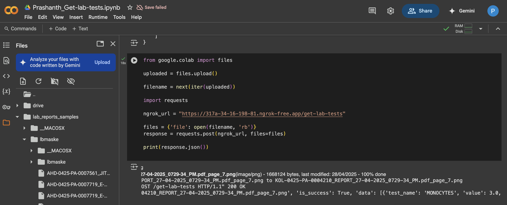
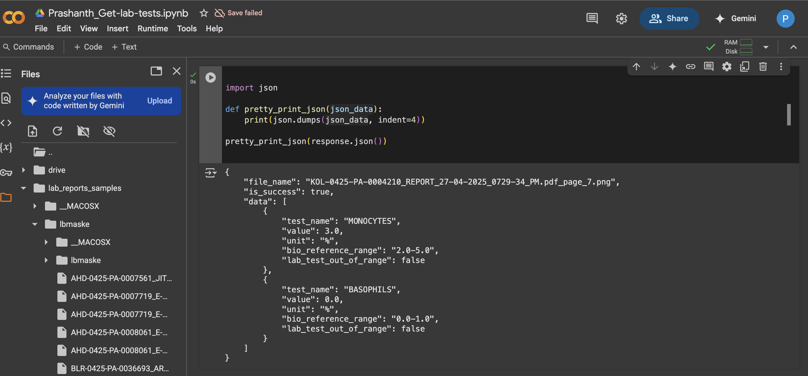
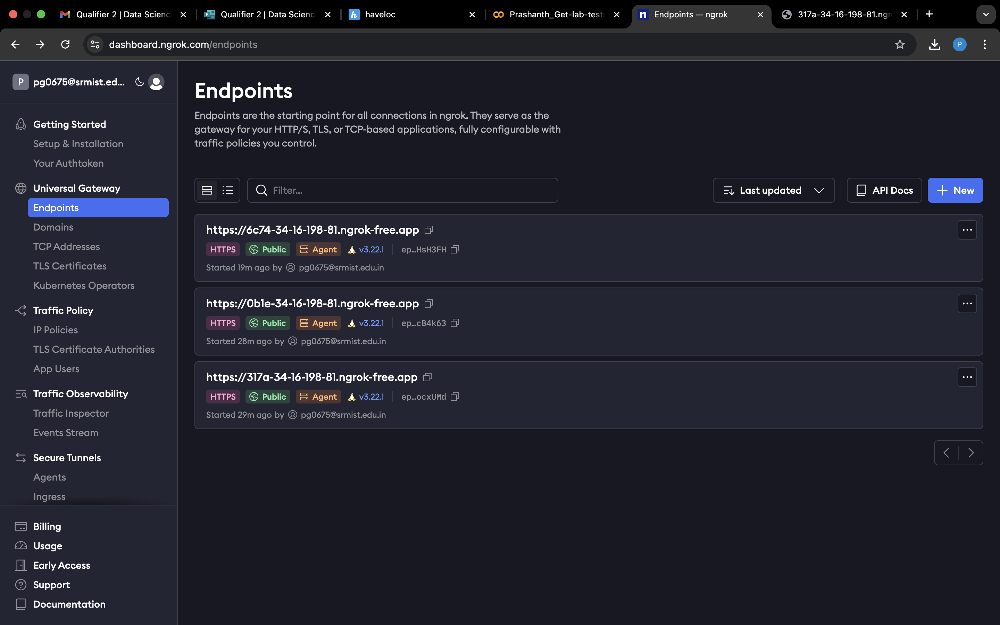
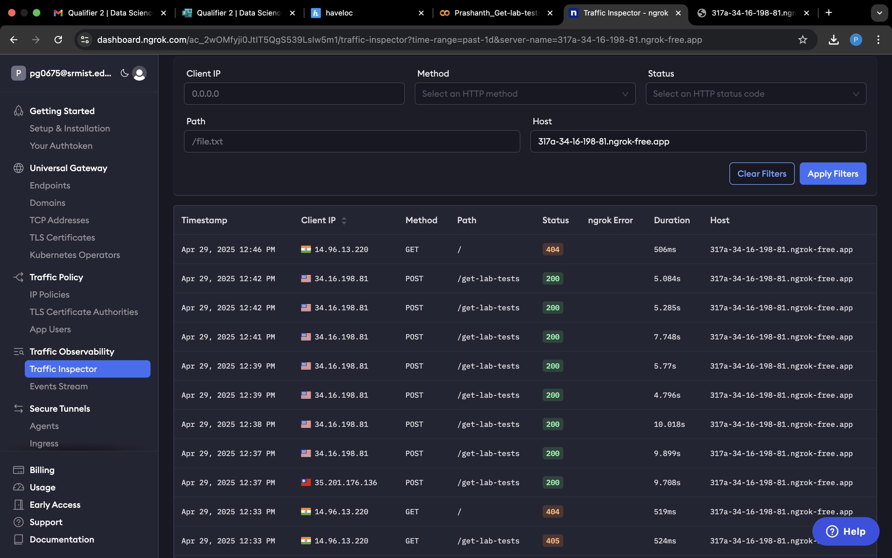

# Lab Test Extraction API
NAME: PRASHANTH G
REGISTRATION NUMBER: RA2211003020102
BATCH:2026
ROLE: DATA SCIENCE

This project provides a scalable and accurate solution to extract lab test names, values, and reference ranges from lab report images. The solution utilizes Optical Character Recognition (OCR) to extract the data and exposes it through a FastAPI-based service. 

### Problem Statement
The goal is to process lab report images, extract the test names, their corresponding values, and reference ranges, and return the data in a structured JSON format. Additionally, a Boolean flag (`lab_test_out_of_range`) is computed to check if the test value lies outside the reference range.

### Example Outputs

1. **Endpoint Processing:**
   

2. **API OUTPUT:**
   

3. **ENDPOINT REGISTRATION:**
   

4. **ENDPOINT TRAFFICS:**
   

### Ngrok Setup for Public Access

2. **Ngrok Public URL**:
 
 
   ]

